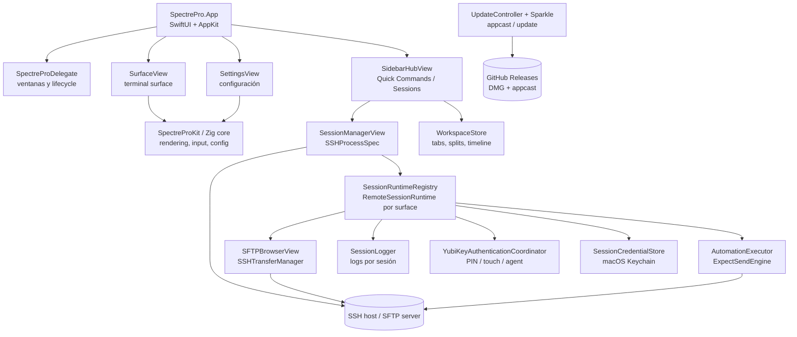
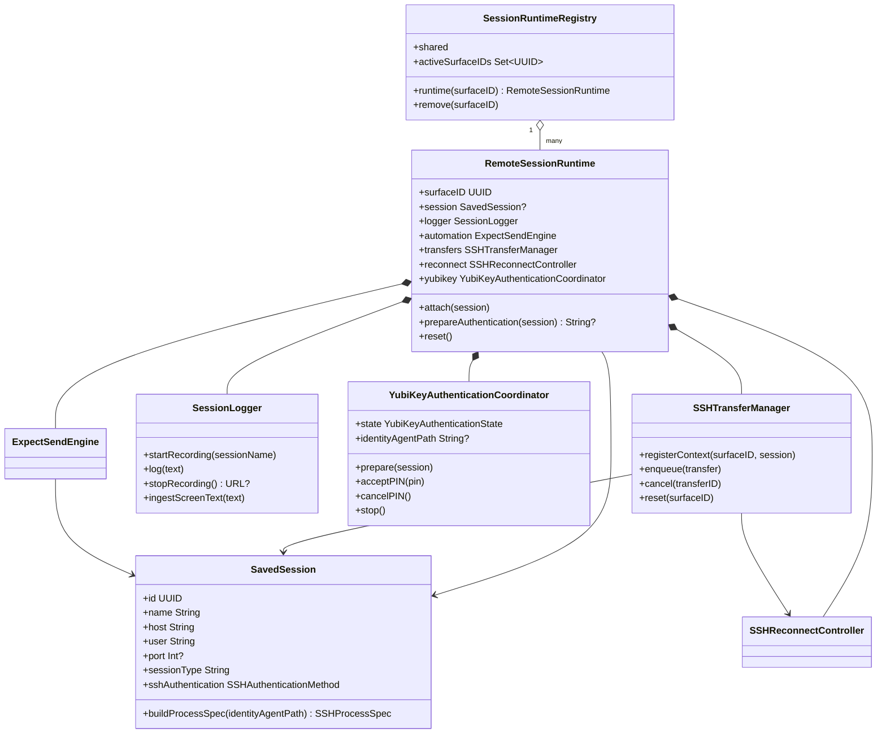
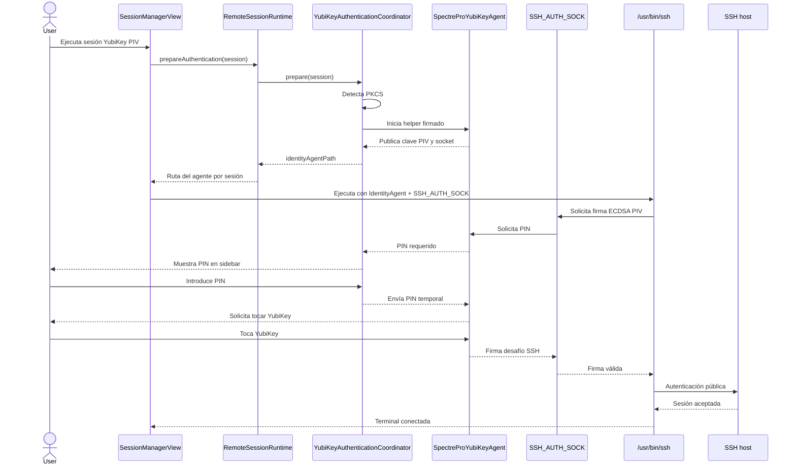
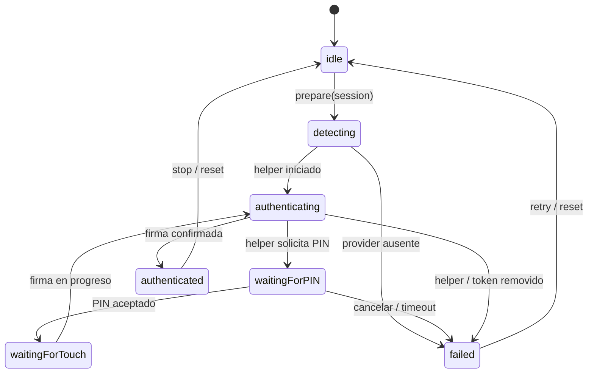
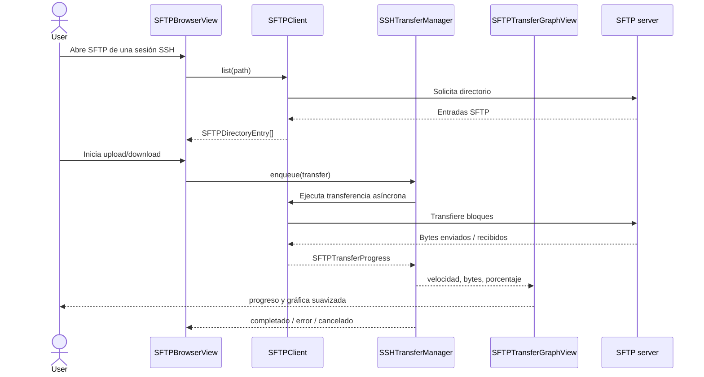
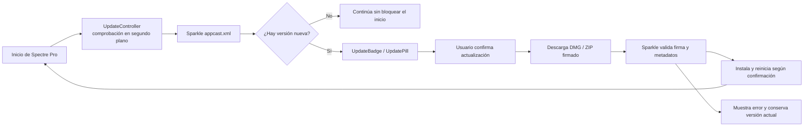
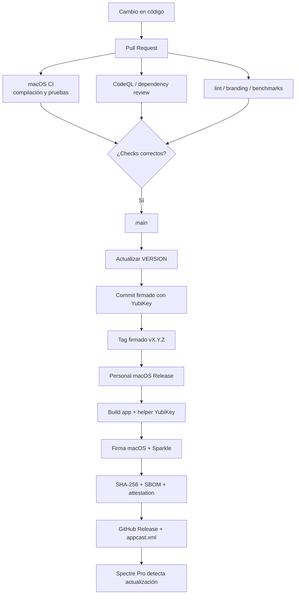

# Spectre Pro — UML de arquitectura

Estos diagramas describen la arquitectura actual de la aplicación macOS según los módulos de `macos/Sources`.

## Componentes principales

## Modelo de clases de sesión

## Conexión SSH con YubiKey PIV

## Estados de autenticación YubiKey

## Flujo SFTP y transferencias

## Actualizaciones de la aplicación

## CI/CD y publicación

